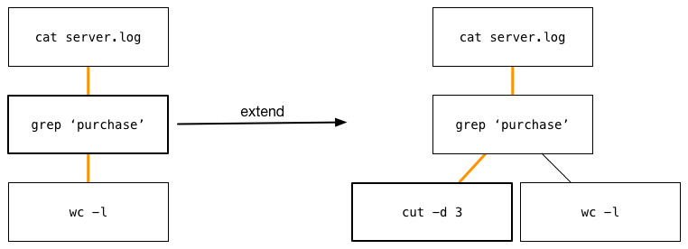
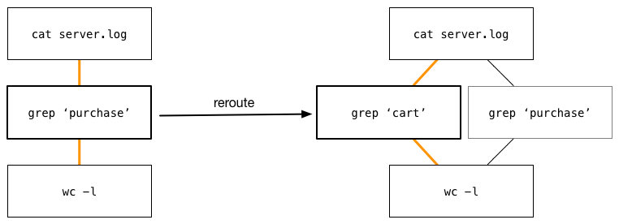
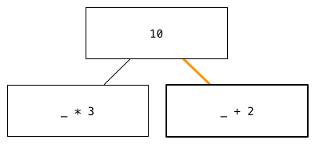
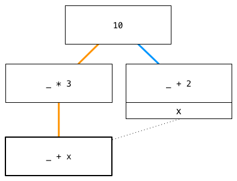
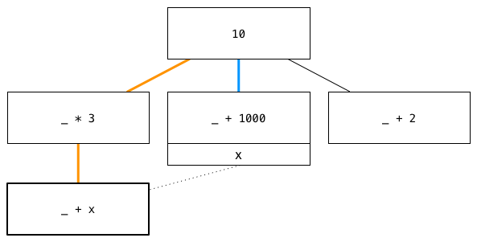
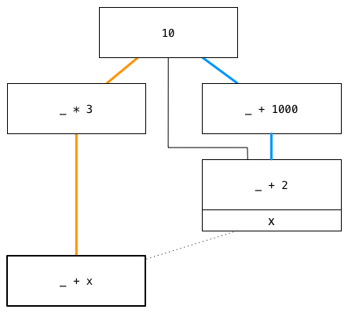
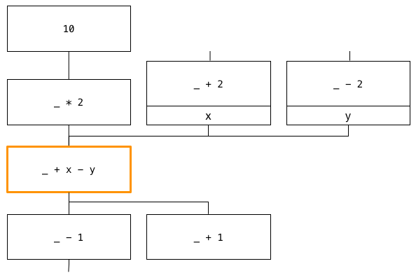
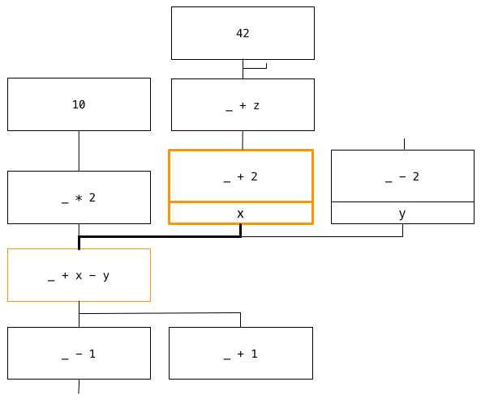
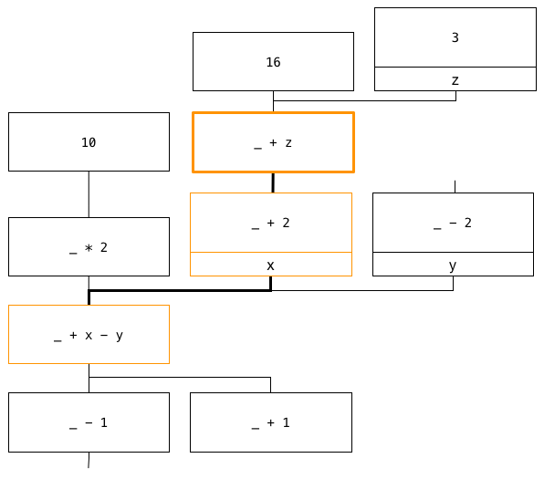
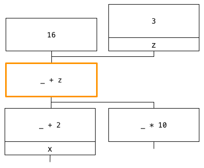

**NOTE:** this is an early draft, describing work which is still in flux.  If you are interested in learning more, feel free to contact me at ztellman@gmail.com.  

---

There are two phases of programming, explanation and exploration.  **Explanatory programming** is possible when we know where we are, where we're going, and how we intend to get there.  The only remaining challenge is to describe our approach correctly and concisely.  

This is only possible when we fully understand our problem space.  If we don't, we can use the act of programming to explore that problem space.  **Exploratory programming** is necessary when we need to better understand the nature of our inputs, the possible outputs, and the best paths between them.

A source file is an explanatory artifact; it presents the destination, but obscures the journey.  Source control offers neither the granularity nor the ease of navigation to change this.  Our existing programming tools focus almost entirely on the explanatory phase, and treat what comes before as little more than an embarrassment.  

What would a tool focused on exploratory programming look like?

### the journey

[in a small bit of irony, for the moment I'm going to skip straight to the design decisions below, but something will go here eventually]

### data model

Our model is a dataflow graph, where each vertex represents a pure transform of the data from the vertices above it.  To explore new approaches, we may either create a new graph, or extend an existing one.  There are three fundamental transforms, **extend**, **reroute**, and **interpose**, and **bind**.

Here we take a simple bash pipeline, and branch off in a new direction.  Our execution path, shown by the orange line, has also been redirected:

Alternately, we can change an intermediate step, but preserve its relationship to the vertices below it: 

Lastly, we may want to insert a new intermediate step.  Note that the original connection is preserved, but no longer in use:

Put another way, extend adds a new vertex, reroute alters an existing vertex, and interpose alters an existing edge.  All of these changes are non-destructive; we may have selected a new execution path, but our historical paths still remain.

Each node in a bash pipeline may only have a single input, but what if a node requires multiple inputs?  Consider these arithmetic expressions:

We have extended off in two directions, but currently have no way to combine these values.  In our model, all dependencies beyond the first must be referred to **lexically**, or by name.  We **bind** a name to an execution path in our graph, and refer to that name elsewhere:

Note that two paths are highlighted: the orange is our selected path, and the blue is the path associated with `x`.  Since our path depends on `x`, both paths must be evaluated.

We can rebind `x` to a different path, and the result of our execution will change.  The operations described above will also change any lexical paths that pass through the vertices.  This transformation can be achieved by rerouting, or by extending and binding:

Likewise, interposing will automatically update the downstream bindings:

Unlike textual languages, this lexical mechanism does not allow for nested scopes, where `x` refers to a different path in a subset of our graph.  It can be helpful to think of each graph as a namespace, and each lexical binding as a value that can be imported by another namespace.  If a name means different things in different contexts, those contexts should each have their own graph.

### interaction model

The diagrams shown above are useful for understanding how the data model changes, but they would make for a poor user interface.  Graph layout is a global optimization problem, meaning that a single new edge can completely transform how the graph is displayed.  This is fine if our graph is static, but we're trying to build a graph *editor*.  We want our layout to be as coherent as possible as the graph changes, so we don't get lost.  The existing literature has nothing to say on this subject.

But this is making the problem harder than it has to be.  Thinking of this as a global optimization problem assumes we care equally about every vertex and every edge in our graph.  In fact, we care a great deal about the dependencies of our current execution path, and far less about everything else.  And of vertices on our execution path, we care more about the ones at the bottom because they are most likely to change.

If a vertex is important, it should be easy to find and change.  For everything else, it only needs to be possible.  The interaction model described here is guided by this, as well as a few other restrictions:

* the graph should be easily navigable using the keyboard
* edges should never intersect, as disentangling them always requires conscious effort on the part of the viewer

The former restriction suggests our layout should be rectilinear, echoing the rows and columns of a text editor.  The latter restriction suggests that we must be very parsimonious about which vertices and edges we draw, as the transforms described above make it trivial to construct a [non-planar graph](https://en.wikipedia.org/wiki/Planar_graph).  

To accomplish this, we represent the graph as two trees extending upward and downward from a central vertex.  Directly above the central vertex, we show its execution path, and to the upper-right we show its lexical dependencies.  Below the central vertex, we show any dependents.  

From this central vertex, we can **navigate** in any direction.  Note some of the vertices have dangling edges above or below, indicating vertices which are not currently being shown.  If we navigate to vertices above the center, we display the dependencies above.  If we navigate to vertices below the center, we display the dependents below.

Here, we navigate up and right to see how `x` is defined:

We see a reference to `z`, and navigate up once more to learn about it:

Notice that we are expanding out the dependents and/or dependencies of every vertex we've navigated through.  This means that as we navigate further and further, more and more of the graph is shown.  If we want to zero in on the current vertex, we can **recenter** our view of the graph:

The relative position of the adjacent vertices remains the same, but now we can also see other dependents of our central vertex.  If we change our mind, and want to return to the previous central vertex, we can simply hit down a few times; the left-to-right layout of the vertices remembers which ones we've recently traversed.

While navigating, we're also able to use the extend, reroute, and interpose transforms described above.  In cases where each vertex contains arbitrary text, the client should create an empty space for text entry, and only commit it to the graph once it has passed some basic validation.

---

The diagrams shown here are meant to describe the interaction mechanism, not the UI itself.  Notably absent is any attempt to show the result of the execution path, which could potentially be added to the central vertex, all vertices, or something in between.  

This is in part because it's still early days, and my UI prototypes (which broadly resemble these diagrams) are filled with arbitrary decisions that I can't defend.  It's also, however, because I don't want to couple the abstract ideas described here with any particular implementation.  I am fairly confident that the data model is solid, and I think the interaction model is promising, but how they should be realized in any particular domain is still an open question.

